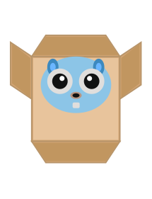
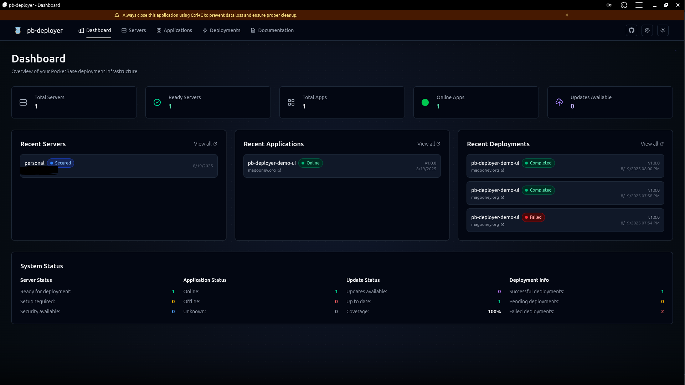
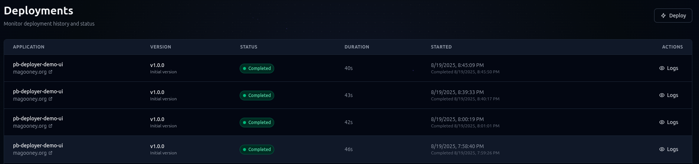

<div align="center">
  
  <h1 align="center">pb-deployer</h1>
  <h3 align="center">Automates the lifecycle of deploying PocketBase apps to production</h3>
  <a href="https://github.com/magooney-loon/pb-deployer/stargazers"></a>
  <a href="https://github.com/magooney-loon/pb-deployer/graphs/contributors"></a>
  <a href="https://github.com/magooney-loon/pb-deployer/blob/main/LICENSE"></a>
  <br>
  
  <h5 align="center"><strong>WARNING</strong> — HOBBY PROJECT</h5>
</div>

[](https://deepwiki.com/magooney-loon/pb-deployer)

## 🚀 Quick Start

Install the [pb-cli](https://github.com/magooney-loon/pb-ext) toolchain:

```bash
go install github.com/magooney-loon/pb-ext/cmd/pb-cli@latest
```

Then in the pb-deployer directory:

```bash
pb-cli --install   # install dependencies
pb-cli             # development mode (build + serve)
pb-cli --production # production build
```

## pb-cli Toolchain

pb-deployer uses the [pb-cli](https://github.com/magooney-loon/pb-ext) build toolchain for development and production workflows.

| Command | Description |
|---------|-------------|
| `pb-cli` | Development mode — builds frontend + starts server |
| `pb-cli --install` | Install all dependencies (Go modules + npm) |
| `pb-cli --build-only` | Build frontend only |
| `pb-cli --run-only` | Start server only (no rebuild) |
| `pb-cli --production` | Production build → `dist/` directory |
| `pb-cli --test-only` | Run test suite with coverage |
| `pb-cli --help` | Show help |

Full pb-cli documentation: [pb-ext README](https://github.com/magooney-loon/pb-ext)

## Core Workflow

1. **Server Registration**: Add remote host connection details
2. **Server Setup**: Automated user creation, directory structure, and Caddy install
3. **Security Lockdown**: Firewall, fail2ban, disable root SSH (optional)
4. **App Creation**: Add apps with auto-assigned loopback ports and domain
5. **App Deployment**: Upload prod dist, systemd service, Caddy reverse proxy config
6. **Version Management**: Rollback support with file storage

## Multi-App Architecture

Multiple PocketBase apps run on the same VPS behind a single Caddy reverse proxy:

```
                                 Internet
                                    │
                               :80 / :443
                                    │
                        ┌───────────▼───────────┐
                        │        Caddy           │  (systemd: caddy.service)
                        │  - automatic HTTPS     │
                        │  - imports conf.d/*    │
                        └────┬───────┬───────┬───┘
                             │       │       │
                   127.0.0.1:8091  :8092  :8093   (loopback only)
                             │       │       │
                        ┌────▼──┐ ┌──▼──┐ ┌──▼──┐
                        │ blog  │ │shop │ │ api │   (per-app systemd units,
                        │ pb    │ │ pb  │ │ pb  │    run as `pocketbase` user)
                        └───────┘ └─────┘ └─────┘
```

- Only Caddy binds `:80` and `:443`; each PocketBase binds `127.0.0.1:<port>`
- Per-app Caddy fragments at `/etc/caddy/conf.d/<app>.caddy`
- Auto-assigned ports in range `8090–8999`, unique per server

## Directory Structure

```
/opt/pocketbase/
├── apps/           # Per-app deployment directories
├── backups/        # Timestamped deployment backups
├── logs/           # Application + Caddy access logs
└── staging/        # Temporary staging during deployments
```

## Deployment Pipeline (12 Steps)

1. Downloading and staging deployment package
2. Checking service status
3. Stopping existing service
4. Creating backup of current deployment
5. Preparing deployment directory
6. Installing new version
7. Creating/updating systemd service (`--http=127.0.0.1:<port>`)
8. Configuring reverse proxy (writes Caddy fragment, validates, reloads)
9. Creating superuser (if initial deployment)
10. Starting service
11. Verifying deployment health (loopback + public HTTPS probes)
12. Finalizing deployment

Rollback restores backup + Caddy fragment on failure.

<div align="center">
  
</div>

## Prerequisites

- SSH keys loaded — check with `ssh-add -l`
- Remote server accessible via SSH as root

## Documentation

See `AGENTS.md` for the full project reference including architecture, API routes, frontend stores, and key patterns.

## Contribution

PRs are encouraged, but consider opening a discussion first for minor/major changelogs.
