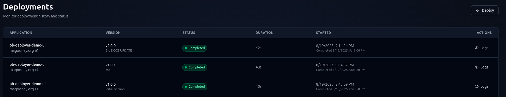

<div align="center">
  
  <h1 align="center">pb-deployer</h1>
  <h3 align="center">Automates the lifecycle of deploying PocketBase apps to production</h3>
  <a href="https://github.com/magooney-loon/pb-deployer/stargazers"></a>
  <a href="https://github.com/magooney-loon/pb-deployer/graphs/contributors"></a>
  <a href="https://github.com/magooney-loon/pb-deployer/blob/main/LICENSE"></a>
  <br>
  
  <h5 align="center">**WARNING**HOBBY PROJECT**</h5>
  <a target="_blank" href="https://magooney.org/">Web Demo UI</a>
</div>

## 🚀 Quick Start

```bash
git clone https://github.com/magooney-loon/pb-deployer
cd pb-deployer
go run cmd/scripts/main.go --install
```

## Core Workflow

1. **Server Registration**: Add remote host connection details
2. **Server Setup**: Automated user creation and directory structure
3. **Security Lockdown**: Firewall, fail2ban, disable root SSH (Optional)
4. **App Deployment**: Upload prod dist, systemd service creation
5. **Version Management**: Rollback support with file storage

## Directory Structure

```
/opt/pocketbase/
├── apps/           # Application deployments (per app directory)
├── backups/        # Deployment backups (timestamped)
├── logs/           # Application logs
└── staging/        # Temporary staging during deployments
```

## Deployment Steps

1. **Downloading and staging deployment package**
2. **Checking service status**
3. **Stopping existing service**
4. **Creating backup of current deployment**
5. **Preparing deployment directory**
6. **Installing new version**
7. **Creating/updating systemd service**
8. **Creating superuser (if initial deployment)**
9. **Starting service**
10. **Verifying & finalizing deployment**

<div align="center">
  
</div>

See `**/*/README.md` for detailed docs.

## Contribution
PRs are encouraged, but consider opening a discussion first for minor/major changelogs.
