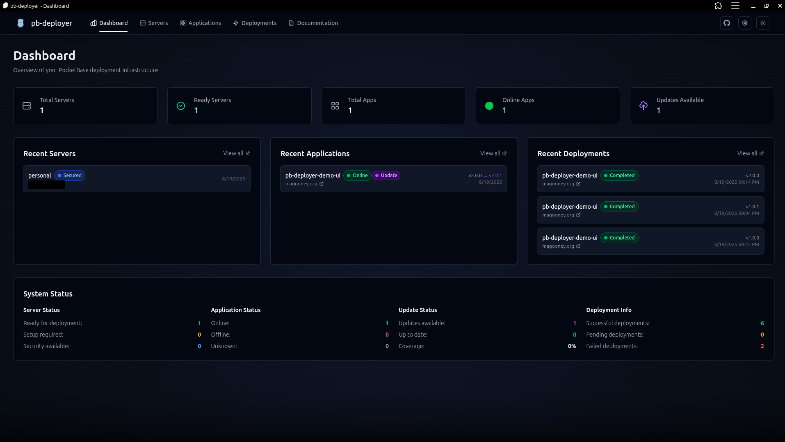

#  pb-deployer

Production deployment automation for PocketBase applications with SSH server management, security hardening, and comprehensive observability.

## Overview

Automates the complete lifecycle of deploying PocketBase apps to production servers with modern Go architecture:
- **Server Setup**: Automated SSH user creation, directory structure, security hardening
- **Deployment**: SFTP transfer protocol && systemd service management
- **Security**: UFW firewall, fail2ban, SSH lockdown with specialized managers
- **Observability**: Comprehensive tracing, connection pooling, health monitoring
- **Configuration**: Type-safe config management with validation and retry logic

## Core Workflow

1. **Server Registration**: Add SSH credentials and connection details
2. **Server Setup**: Automated user creation and directory structure (`/opt/pocketbase/apps/`)
3. **Security Lockdown**: Firewall, fail2ban, disable root SSH
4. **App Deployment**: Upload binary + static files, systemd service creation
5. **Version Management**: Rollback support with file storage

## Key Features

- **Modern Architecture**: Dependency injection, no singletons, clean interfaces
- **SSH Connection Pooling**: Persistent connections with automatic health monitoring
- **Specialized Managers**: Domain-specific operations (setup, security, services, deployment)
- **Comprehensive Tracing**: Full observability with structured logging and metrics
- **Security-Aware Operations**: Automatic transition from root to app user after lockdown
- **Zero-Downtime Deployments**: Staging directory with atomic swaps
- **Real-time Progress**: WebSocket updates with detailed operation tracking
- **Type-Safe Configuration**: Generic config management with validation
- **Automatic Backup/Rollback**: Safe production deployments with version tracking

See `internal/*/README.md` for detailed component documentation.
